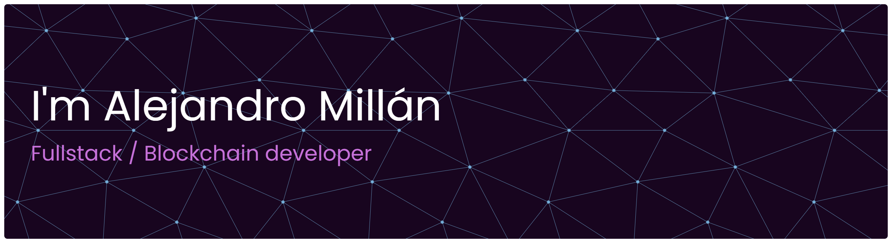

 

Soy Alejandro Millán, desarrollador full-stack con experiencia construyendo aplicaciones web completas y orientadas al usuario. Actualmente estoy enfocando mi carrera hacia el desarrollo Blockchain y Web3, combinando mis habilidades en frontend y backend con tecnologías de contratos inteligentes y aplicaciones descentralizadas. Me apasiona aprender, crear soluciones eficientes y formar parte del crecimiento del ecosistema Web3

# 💻 Tech Stack

                      	

# 📊 GitHub Stats:

| Profile| Stats | 
|--------|--------------|
|  |   |  |

###

## 🌐 Socials:

  

---

<!-- Proudly created with GPRM ( https://gprm.itsvg.in ) -->
